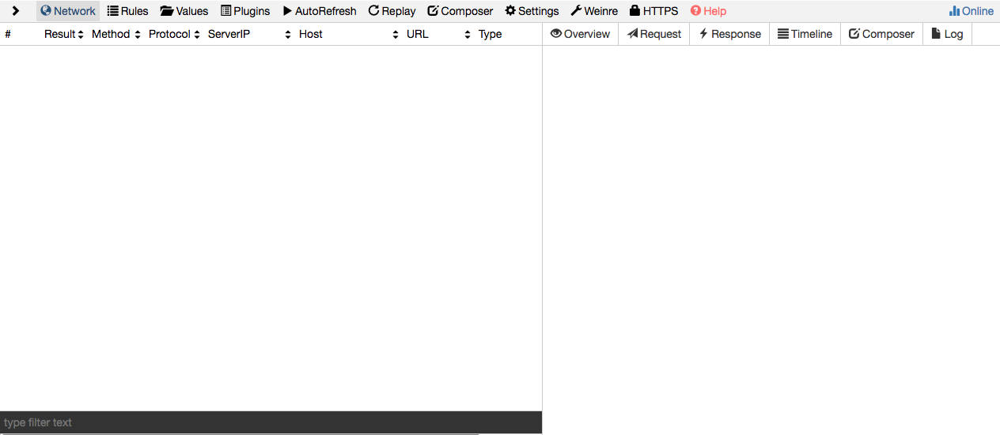
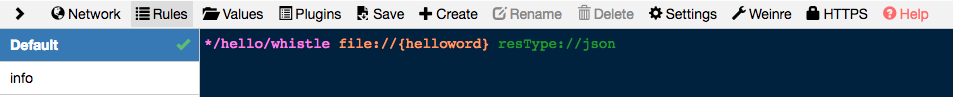
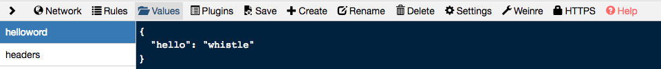
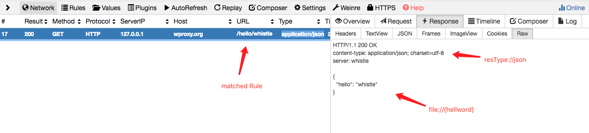
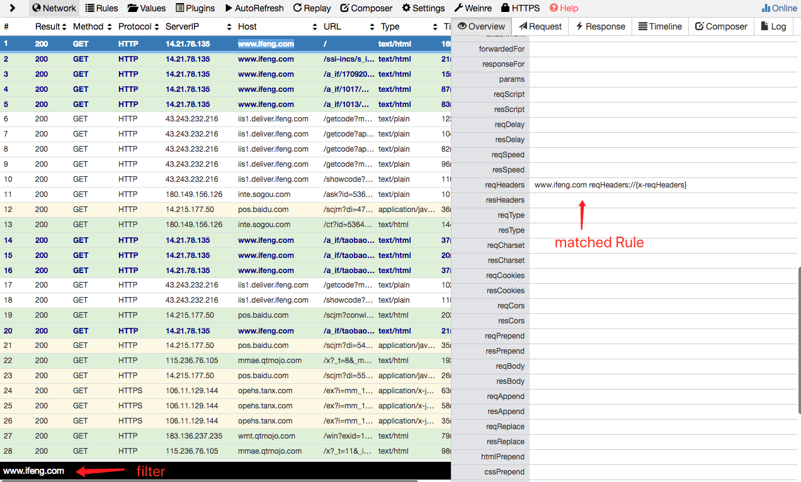
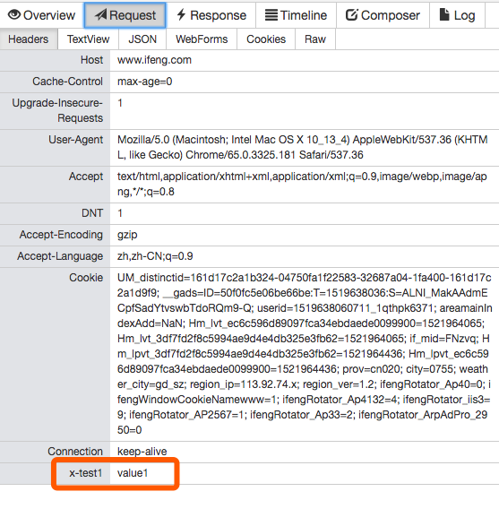

<p align="center">
  <a href="https://avwo.github.io/whistle/">
    
  </a>
</p>

# whistle
[](http://nodejs.org/download/)
[](https://travis-ci.org/avwo/whistle)
[](https://codecov.io/gh/avwo/whistle)
[](https://npmjs.org/package/whistle)
[](https://www.npmjs.com/package/whistle)
[](https://www.npmjs.com/package/whistle)

[README in English](README.md)

whistle(读音`[ˈwɪsəl]`，拼音`[wēisǒu]`)是基于Node实现的跨平台调试代理工具。

它提供了如下基本功能：

1. 提供HTTP代理服务
2. 抓包、重放或构造HTTP、HTTPS、WebSocket及普通的Socket(TCP)请求
3. 通过规则组合的配置方式操作请求或响应，且支持域名、路径、正则表达式、通配符、通配路径等多种[匹配模式](https://avwo.github.io/whistle/pattern.html)
4. 内置移动调试功能

## whistle 获取和安装
whistle的安装是非常简单的。在安装完node(推荐版本v6以上)之后，打开命令行运行 whistle start 或者简写方式 w2 start，即启动了whistle后台程序。[详细的安装指南](http://wproxy.org/whistle/install.html)

whistle采用了web界面，从而只需要一个浏览器就能随意访问，不会受到操作系统平台影响，甚至可以直接远程访问，相当的方便。在浏览器中输入: http://127.0.0.1:8899，就能看到whistle的界面了。如果有任何异常，请先参考[常见问题](http://wproxy.org/whistle/questions.html)。


## whistle 名词解释
在使用whistle之前，有必要了解一下这几个名词概念：Rule， Value 和 Protocol

**Rule**，格式为：<目标规则> <响应操作1> ... <响应操作n> 

其作用是寻找满足指定规则的url，对其请求，回复进行操作，包括修改http请求的header, content， http回复的header, content，状态码等等，这些不同的响应操作，whistle按照类型将其分类，称之为**Protocol**，不同的Protocol可以在同一个Rule中同时配置。更多Protocol，请移步[协议列表](http://wproxy.org/whistle/rules/)。 

**Value** 是一个非常便利的特色功能。可以认为是whistle本身提供的一个key-value数据库，通过在Rule中直接使用{key}引入实际的Value内容，而不需要提供本地文件路径。对于Value的管理，请看[这里](http://wproxy.org/whistle/webui/values.html)。

请看一个Rule示例：
```*/hello/whistle file://{helloword} resType://json```  

该示例中，***/hello/whistle** 为目标规则，**file:** 和 **resType:** 为Protocol，其后分别指定了对应的操作内容，`{helloword}`为Value。最终，该示例的效果就是，对于匹配成功的http请求，使用 Value {helloword}作为http响应，并修改http header的Content-Type字段为：application/json，最后直接返回给浏览器。效果请看下图。我们会发现，http://wproxy.org/hello/whistle 是捏造的一个URL地址，但是通过whistle的Rule将该请求拦截并成功进行修改。






## whistle 开始使用
顺利打开 http://127.0.0.1:8899 之后，看到的页面即whistle web-ui，通常切换不同的菜单标签来实现日常操作。这里先简单介绍几个常用的标签：Network，Rules，Values，以及HTTPS。

Rules 和 Values ，即分别为Rule和Value的管理界面，而Network则是经过whistle这个http代理的流量。一开始的时候，会发现Network面板下是一片空白。这是因为我们还没有对系统或者浏览器进行http代理的配置，配置其转发流量到whistle。具体的配置请看这里：http://wproxy.org/whistle/install.html。

成功配置http代理之后，可以看到Network面板开始忙碌了起来，一条条请求在不断刷屏。这时我们可以通过Filter来减少界面上展示的内容。

点击任意一个请求，都可以在右侧面板中看到详情，如请求内容，回包内容，请求连接耗时等。

也许你会发现，对于https请求，浏览器会给出”不安全”的访问提示，这是因为还没有安装whistle的CA根证书，请参照[这里](http://wproxy.org/whistle/webui/https.html)，对应不同平台进行安装。安装成功之后，重启浏览器即可正常监听本地的https流量。

请看动图演示：


接下来，我们对捕获的流量进行一些修改：
在Rules面板，在Default分组添加一行：
```www.ifeng.com reqHeaders://{x-reqHeaders}```

在Values面板中，新建一个key为x-reqHeaders的Value：
```x-test1: value1```
然后在配置了whistle代理的浏览器中访问 www.ifeng.com，此时可以看到Network面板中，www.ifeng.com 的浏览记录字体被加粗显示，并且右侧的Overview面板可以看到其命中的是哪一个Rule，查看该请求，可以发现请求已经带上了我们自定义的header。当然，Values面板只是为我们提供一个方便的在线的内容管理，我们也可以将内容保存到本地文件，再进行映射。参考[这里](http://wproxy.org/whistle/rules/rule/file.html)。



## whistle 能做什么
从前面的几个例子可以看到，whistle 提供了方便的修改请求和响应的机制，这些在用法在与Fiddler或者Charles并没有太大差异。事实上，whistle提供的可不止这些。


whistle 可以通过

  1. 参数替换[urlParams](http://wproxy.org/whistle/rules/urlParams.html)和模板[tpl](http://wproxy.org/whistle/rules/rule/tpl.html)更加灵活地修改请求和响应

  2. 也内置[weiren](http://wproxy.org/whistle/rules/weinre.html)和[log](http://wproxy.org/whistle/rules/log.html)辅助web调试

  3. 支持[socks代理](http://wproxy.org/whistle/rules/socks.html)和[pac](http://wproxy.org/whistle/rules/pac.html)

  4. 甚至也提供了[websocket](http://wproxy.org/whistle/webui/websocket.html)的调试功能

  5. 如果这些功能还无法满足你的需求，那可以考虑开发插件([Plugins](http://wproxy.org/whistle/webui/plugins.html))来实现更多自定义的功能。

### 功能全景展示如下：


