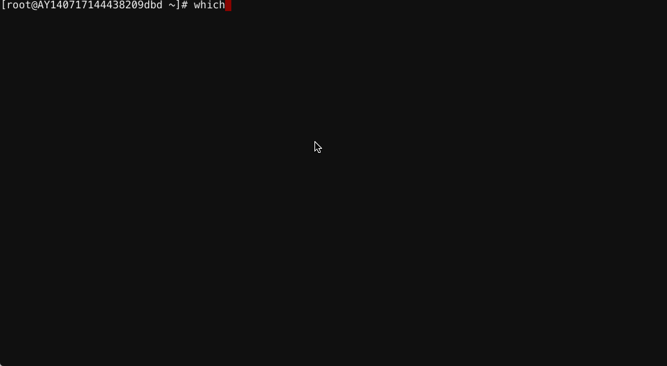

# Linux上配置开机重启whistle

Linux不完全支持双击脚本文件自动执行(需要whistle v1.0.0及以上版本)，只能设置开机自动重启whistle，[安装完whistle](https://whistle.gitbooks.io/help/content/install.html)后执行`which w2`查看命令行安装的路径(一般为`/usr/local/bin/w2`)，编辑启动执行的文件`sudo vi /etc/rc.d/rc.local`，在最后一行加入`/usr/local/bin/w2 restart`(`/usr/local/bin/w2`视`which w2`输出的字符串为准)。

