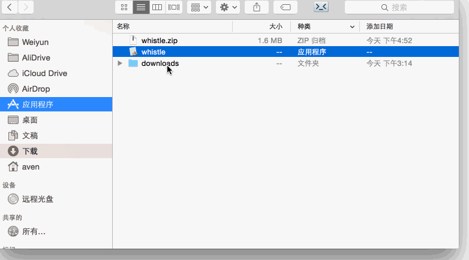

# Mac上配置开机重启whistle
首先，下载Mac上的whistle脚步文件：[whistle.zip](https://github.com/avwo/whistle/raw/avenwu/assets/launcher/mac/whistle.zip)。

1. 解压whistle.zip获取whistle脚本文件，把该脚本文件拷贝一份到**应用程序**，打开桌面即可看到whistle这个脚本文件，这样可以直接在Mac的桌面上刊登whistle的启动脚本，点击该文件即可重启whistle;

	

2. **打开设置 --> 打开用户与群组 --> 点击左下角的锁 --> 输入密码解开锁 --> 打开登录项 --> 点击下方的+按钮 --> 在应用程序目录里选择whistle --> 勾选上复选框**，这样就配置好了开机自动重启whistle。

