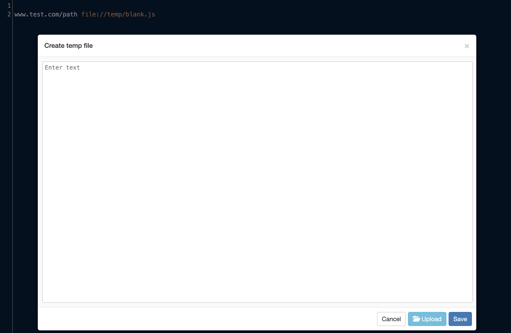

# Rules 界面

Rules 界面是 Whistle 的核心配置区域，用于管理所有代理规则及其分组。


## 界面基本功能

| 控件         | 功能                                           |
| ------------ | ---------------------------------------------- |
| **ON**       | 关闭或打开规则，红色：开启中，灰色：关闭中     |
| **Import**   | 导入规则                                       |
| **Export**   | 导出规则                                       |
| **Save**     | 保存并启用规则                                 |
| **Create**   | 新建规则/分组                                  |
| **Delete**   | 删除规则/分组                                  |
| **Rename**   | 重命名规则/分组                                |
| **Settings** | 设置编辑样式                                   |
| **右键菜单** | 除了集成上面的菜单功能，还支持插件扩展菜单功能 |


## 高级编辑功能

**临时文件编辑**

``` txt
... protocol://temp/blank.js
```
- `protocol`：为[操作协议](../rules/protocols)
- `temp/blank.js`：空白的临时文件

**操作流程：**
1. 输入协议操作内容的路径（如 `file://temp/blank.js`）
2. Ctrl + 鼠标点击（Win）/ Cmd + 鼠标点击（Mac）路径
3. 在弹出编辑器修改内容
4. 保存后自动关联到规则


