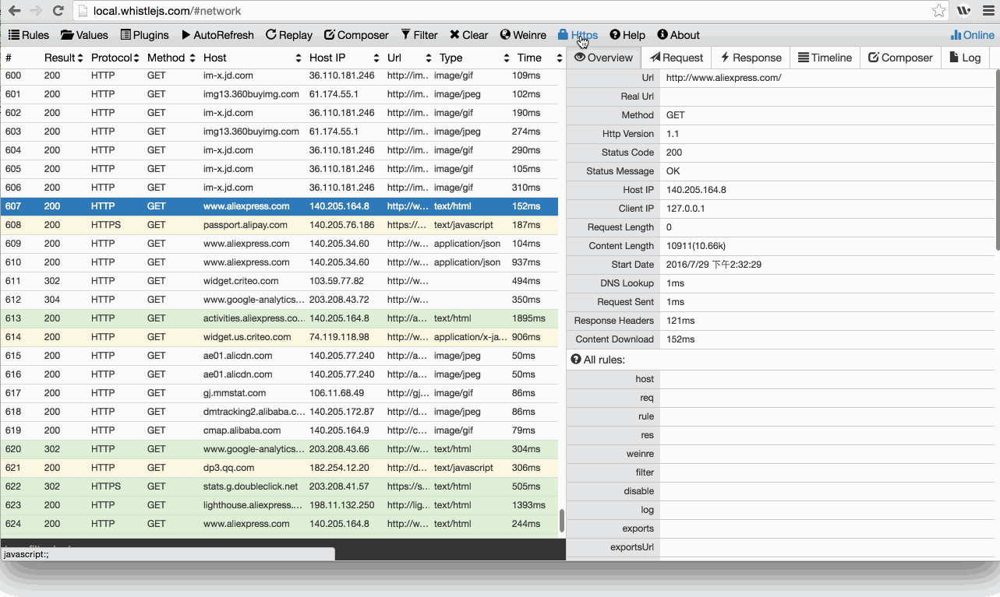

# Https

> It is recommended to use `Node v6` or above, otherwise there will be performance issues, and there will be problems with capturing HTTPS requests on Chrome or App.

> If there is a problem with HTTPS ([#44](https://github.com/avwo/whistle/issues/44)), upgrade Node to `v6` and above, [update whistle](https://avwo .github.io/whistle/update.html) to the latest version, start a new certificate with `w2 restart -A` (note the addition of `-A`) and install the next root certificate.

> **When installing a root certificate on iOS, you need to disable `HTTPS interception` first, otherwise the installation fails. **

This document will show you:

* How to download root certificates
* and enable HTTPS interception.



## Installing a Root Certificate

Click the rootCA.crt file after downloading the root certificate as shown above, and the root certificate installation dialog box will pop up.

1. Windows:

  [Installing a root certificate on Windows](https://msdn.microsoft.com/en-us/library/cc750534.aspx)

  

  After downloading the certificate, double-click the certificate and follow the instructions to install the certificate. During the certificate installation process, ensure that the certificate is stored under `Trusted Root Certification Authorities`.
2. Mac: [How to Install a Root Certificate on Mac](https://support.untangle.com/hc/en-us/articles/212220648-Manually-installing-Root-certificate-on-a-MAC)

  After the Mac installs the certificate, you need to trust the certificate manually. The steps are as follows:

  Open the certificate management interface and find the certificate with the word “whistle”. If there is more than one and it is not sure which one is the latest installation, you can delete it and re-install it.

  

  After double-clicking the certificate, click on the "Trust" option to expand the left side, select "Always Trust" for the red part, click on the upper left corner to close the current interface and ask for the password; after entering the password
  Intallation would be completed once you see that the red icon `x` on the certificate is missing.

  
3. Firefox:

  Menu> Preferences> Advanced> Certificates> Certificate Authority> Import -> Check all checkboxes -> OK
4. Linux Chrome (Chromium): Refer to this [Tutorial](http://www.richud.com/wiki/Ubuntu_chrome_browser_import_self_signed_certificate)
  * Enter chrome://settings/ in the address bar
  * Show advanced Settings> Manage letters> Authorities> Import
  * Confirm after selecting the certificate and restart the browser
  * done

  
5. Mobile phone

  **iOS**
  * After setting the proxy on the mobile phone, enter `rootca.pro` in Safari's address bar and follow the prompts to install the certificate (or scan the QR code generated by whistle Web UI to install. Before finishing installation a root certificate on iOS, the os needs to connect to the remote server for verification. So you need to temporarily disable the **Https interception function** )
  * Manually trust the custom root certificate after iOS 10.3: `Settings> General> About> Certificate Trust Testings`

  [Trusting custom root certificates on iOS 10.3](http://www.neglectedpotential.com/2017/04/trusting-custom-root-certificates-on-ios-10-3/)

  

  **Android**
  * Download whistle Certificate: Scan the QR code generated by `whistle` Web UI, or enter `rootca.pro` in browser address bar
  * Some browsers do not automatically recognize ca certificates. You can use Android Chrome to complete the installation

## Intercept HTTPS

The dialog in the figure has two checkboxes (** When installing a root certificate on iOS, remember not to enable ~~`Intercept HTTPS CONNECTs`~~ `Capture HTTPS CONNECTs`, otherwise it will not install successfully **):

1. ~~`Hide HTTPS CONNECTs`: Hiding requests with `connect` type~~
2. ~~`Intercept HTTPS CONNECTs`~~ `Capture HTTPS CONNECTs`: Enable Https interception. Only by installing the root certificate and checking this checkbox and, can whistle see the HTTPS, Websocket request

You can also intercept Https by configing a `filter` rule:

```plain
Www.test.com filter://intercept
/alibaba-inc/ filter://intercept
```

And disable intercepting Https by configing a `disable` rule:

```plain
# Specify a domain name
Www.baidu.com disable://intercept

# specify the domain by regex
/baidu/ disable://intercept
```
