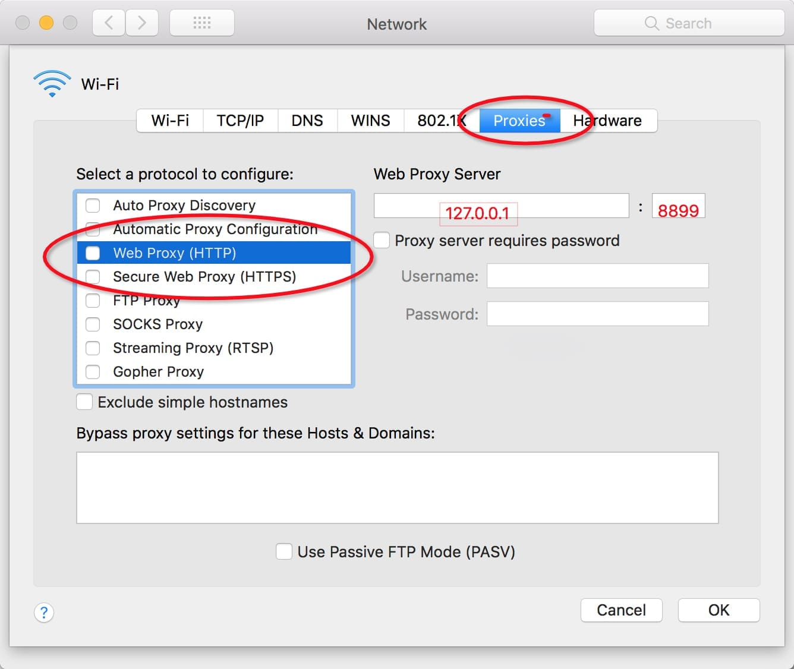

# How to set proxy

## Proxy server

1. proxy server: 127.0.0.1 (If deployed on a remote server or virtual machine, change to the ip of the corresponding server or virtual machine.)
2. port: 8899 by default. If the port is occupied, the new port can be specified at startup using `-p`. More information can be viewed by executing the command line `w2 help` (`v0.7.0` and above can also use `w2 help`).

> Remember to check on ** Use same proxy server for all protocols **

## Configure proxy setting

1. configure system wide proxy settings:
  * [Windows] (https://farbyte.uk/index.php/knowledgebase/34/How-to-configure-system-wide-proxy-settings-in-Windows.html)
  * [Mac] (https://kb.k12usa.com/knowledgebase/proxy-settings-on-a-mac-os-x): System Preferences> Network> Advanced> Proxies> HTTP or HTTPS
    

      
      
    

  * Linux: Settings> Network> VPN> Network Proxy> Manual

    

      
      
    

2. If you do not wish to configure proxy setting that affect all applications on the system, you may be able to configure a browser proxy.

  * Chrome: Install Chrome Proxy Plugin: [SwitchyOmega](https://chrome.google.com/webstore/detail/padekgcemlokbadohgkifijomclgjgif) is recommended
  
    

  * Firefox: In the address bar, enter `about:preferences`, find `Network Proxy`, select `Manual proxy configuration`, enter the proxy server address and port, then `save` .

    

      
      
    

3. The mobile phone needs to configure the current Wi-Fi proxy in `Settings'. Take iOS as an example:

  

PS: If the proxy is configured and the phone is inaccessible, it may be that the computer firewall is restricting remote access to the whistle port. You may resolve the issue by closing the firewall, or setting up the whitelist. [How to open ports in Windows Firewall] (https://www.windowscentral.com/how-open-port-windows-firewall)
