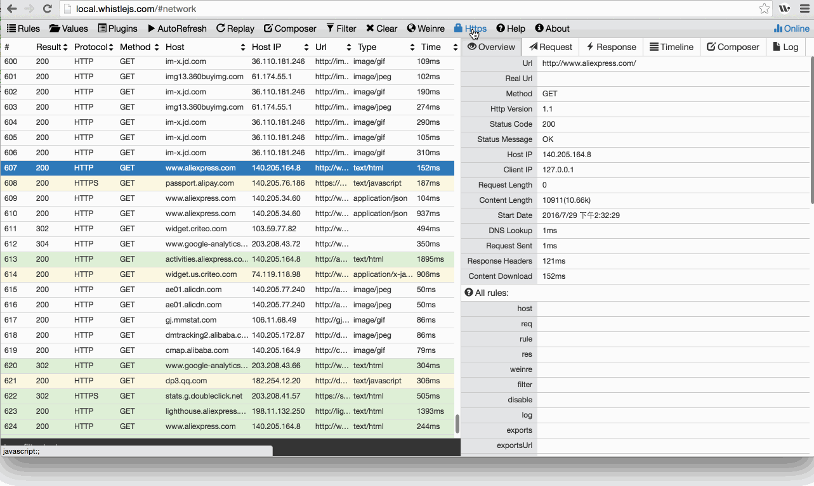
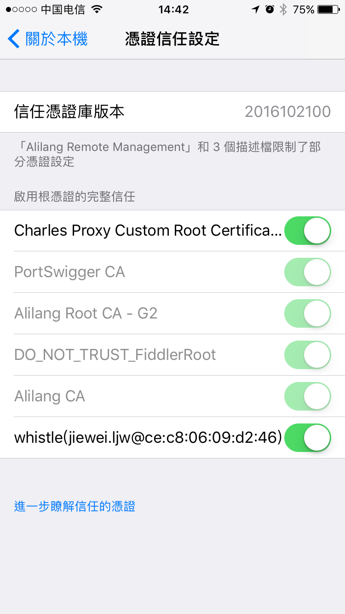

# Https

用来下载根证书、隐藏`connect`类型的请求、开启Https拦截功能。

### 安装根证书

如上图下载完根证书后点击rootCA.crt文件，弹出根证书安装对话框。

1. Windows：[http://program.most.gov.cn/cert/ca.htm](http://program.most.gov.cn/cert/ca.htm)
2. Mac：[mac根证书怎么安装](http://zhidao.baidu.com/link?url=bQ8ZnDTxUIlqruQ56NYjBmwztWPlZtv9AIRazkoKeMsdpAq7mcwXOHQduRwmHV1M2hf143vqBxHzKb1tg0L03DJoj6XS109P8zBNF1E9uU_)
3. **Firefox：菜单 > 首选项 > 高级 > 证书 > 证书机构 > 导入 -> 选中所有checkbox -> 确定**
4. Linux Chrome(Chromium): 参照这个[教程](http://www.richud.com/wiki/Ubuntu_chrome_browser_import_self_signed_certificate)
  * 地址栏输入`chrome://chrome/settings/`
  * Show advanced Settings > Manage certificates > Authorities > Import
  * 选择证书后确认，重启浏览器
  * done

  
5. 手机

  **iOS** 
  * 手机设置代理后，Safari 地址栏输入 `rootca.pro`，按提示安装证书（或者通过 `whistle` 控制台的二维码扫码安装，iOS安装根证书需要到连接远程服务器进行验证，需要暂时把**Https拦截功能关掉**）
  * iOS 10.3 之后需要手动信任自定义根证书，设置路径：`Settings > General > About > Certificate Trust Testings`

  [具体可以看这里](http://www.neglectedpotential.com/2017/04/trusting-custom-root-certificates-on-ios-10-3/)

  

  **Android**
  * `whistle` 控制台二维码扫码安装，或者浏览器地址栏 `rootca.pro` 按提示安装
  * 部分浏览器不会自动识别 ca 证书，可以通过 Android Chrome 来完成安装

### 开启拦截Https

图中的打开的对话框有两个checkbox：

1. ` Hide HTTPS CONNECTs`：隐藏`connect`类型的请求
2. ` Intercept HTTPS CONNECTs`：开启Https拦截功能，只有勾上这个checkbox及装好根证书，whistle才能看到HTTPS、Websocket的请求
3. 也可以通过配置来开启对部分请求的Https拦截功能

   www.test.com filter://intercept
   	/alibaba-inc/ filter://intercept
   ​	

4. 如果想过滤部分请求不启用Https拦截功能

   # 指定域名
   	www.baidu.com  disable://intercept

   	# 通过正则
   	/baidu/ disable://intercept
   	
   	# 不支持通过路径的方式设置
