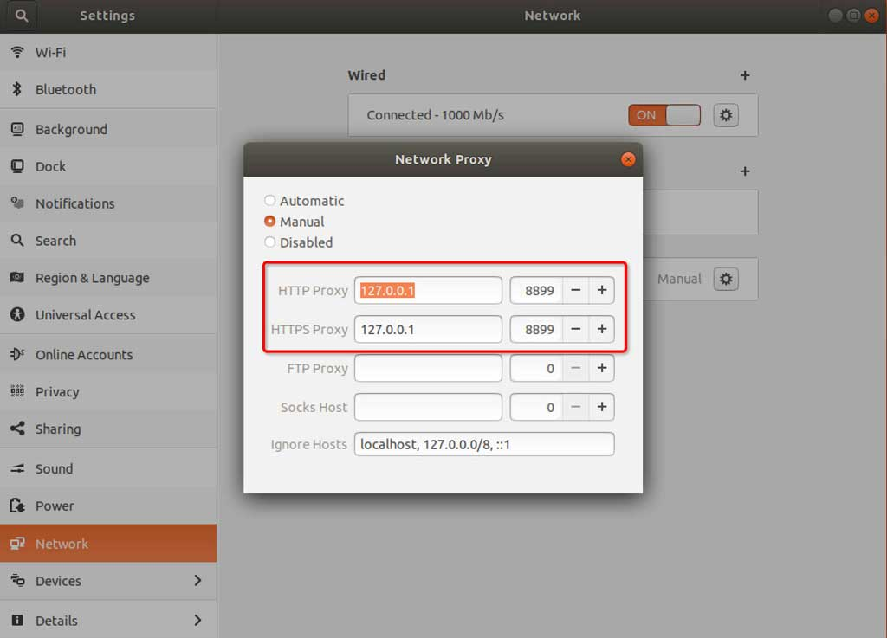

# 安装启动

Mac 或 Windows 系统可以采用一键安装：https://juejin.cn/post/7096345607740063775

whistle安装过程需要以下步骤(缺一不可)：
1. **安装Node**
2. **安装whistle**
3. **启动whistle**
4. **配置代理**
5. **安装根证书**

### 1. 安装Node

whistle支持`v0.10.0`以上版本的Node，为获取更好的性能，推荐安装最新版本的Node。

如果你的系统已经安装了`v0.10.0`以上版本的Node，可以忽略此步骤，直接进入安装whistle的步骤，否则：

1. Windows或Mac系统，访问[https://nodejs.org/](https://nodejs.org/)，安装**LTS**版本的Node，默认安装即可。
2. Linux下推荐使用源码安装: 从[Node官网](https://nodejs.org/en/download/)下载最新版的**Source Code**(或者用`wget`命令下载)，解压文件(`tar -xzvf node-vx.y.z.tar.gz`)后进入解压后的根目录(`node-vx.y.z`)，依次执行`./configure`、`./make`和`./make install`。

安装完Node后，执行下面命令，查看当前Node版本

```sh
$ node -v
v4.4.0
```
如果能正常输出Node的版本号，表示Node已安装成功(Windows系统可能需要重新打开cmd)。

### 2. 安装whistle

Node安装成功后，执行如下npm命令安装whistle （**Mac或Linux的非root用户需要在命令行前面加`sudo`，如：`sudo npm install -g whistle`**）

```sh
$ npm install -g whistle
```

npm默认镜像是在国外，有时候安装速度很慢或者出现安装不了的情况，如果无法安装或者安装很慢，可以使用taobao的镜像安装：

```sh
$ npm install cnpm -g --registry=https://registry.npmmirror.com
$ cnpm install -g whistle

或者直接指定镜像安装：
$ npm install whistle -g --registry=https://registry.npmmirror.com
```

whistle安装完成后，执行命令 `whistle help` 或 `w2 help`，查看whistle的帮助信息

```
$ w2 help

  Usage: whistle <command> [options]

  Commands:

  status              Show the running status of whistle
  use/add [filepath]  Set rules from a specified js file (.whistle.js by default)
  run                 Start a front service
  start               Start a background service
  stop                Stop current background service
  restart             Restart current background service
  help                Display help information

  Options:

  -h, --help                                      output usage information
  -D, --baseDir [baseDir]                         set the configured storage root path
  -z, --certDir [directory]                       set custom certificate store directory
  -l, --localUIHost [hostname]                    set the domain for the web ui of whistle (local.whistlejs.com by default)
  -L, --pluginHost [hostname]                     set the domain for the web ui of plugin  (as: "script=a.b.com&vase=x.y.com")
  -n, --username [username]                       set the username to access the web ui of whistle
  -w, --password [password]                       set the password to access the web ui of whistle
  -N, --guestName [username]                      set the the guest name to access the web ui of whistle (can only view the data)
  -W, --guestPassword [password]                  set the guest password to access the web ui of whistle (can only view the data)
  -s, --sockets [number]                          set the max number of cached long connection on each domain (60 by default)
  -S, --storage [newStorageDir]                   set the configured storage directory
  -C, --copy [storageDir]                         copy the configuration of the specified directory to a new directory
  -c, --dnsCache [time]                           set the cache time of DNS (30000ms by default)
  -H, --host [boundHost]                          set the bound host of whistle (INADDR_ANY by default)
  -p, --port [proxyPort]                          set the proxy port of whistle (8899 by default)
  -P, --uiport [uiport]                           set the listening port of whistle webui
  -m, --middlewares [script path or module name]  set the express middlewares loaded at startup (as: xx,yy/zz.js)
  -M, --mode [mode]                               set the way of starting the whistle mode (as: pureProxy|debug|multiEnv)
  -t, --timeout [ms]                              set the request timeout (66000ms by default)
  -e, --extra [extraData]                         set the extra parameters for plugin
  -f, --secureFilter [secureFilter]               set the path of secure filter
  -R, --reqCacheSize [reqCacheSize]               set the cache size of request data (600 by default)
  -F, --frameCacheSize [frameCacheSize]           set the cache size of webSocket and socket's frames (512 by default)
  -A, --addon [pluginPaths]                       add custom plugin paths
  --httpPort [httpPort]                           set the http server port of whistle
  --httpsPort [httpsPort]                         set the https server port of whistle
  --no-global-plugins                             do not load any globally installed plugins
  --no-prev-options                               do not reuse the previous options when restarting
  -V, --version                                   output the version number

```

如果能正常输出whistle的帮助信息，表示whistle已安装成功。

> 有关命令行参数参见：[命令行参数](options.html)


### 3. 启动whistle

>最新版本的whistle支持三种等价的命令`whistle`、`w2`、`wproxy`

启动whistle:
```sh
$ w2 start
```

*Note: 如果要防止其他人访问配置页面，可以在启动时加上登录用户名和密码 `-n yourusername -w yourpassword`。*

重启whsitle:
```sh
$ w2 restart
```

停止whistle:
```sh
$ w2 stop
```

调试模式启动whistle(主要用于查看whistle的异常及插件开发):
```sh
$ w2 run
```

启动完whistle后，最后一步需要配置代理。

### 4. 配置代理

##### 配置信息

1. 代理服务器：127.0.0.1 (如果部署在远程服务器或虚拟机上，改成对应服务器或虚拟机的ip即可)
2. 默认端口：8899 (如果端口被占用，可以在启动时通过 `-p` 来指定新的端口，更多信息可以通过执行命令行 `w2 help` (`v0.7.0`及以上版本也可以使用`w2 help`) 查看)

> 勾选上 **对所有协议均使用相同的代理服务器**

##### 代理配置方式(把上面配置信息配置上即可)

1. 全局代理 (**推荐**)，**可通过命令行设置参考[设置代理](./proxy.html)**，也可以手动配置：
  * [Windows](http://jingyan.baidu.com/article/0aa22375866c8988cc0d648c.html) 
  * [Mac](http://jingyan.baidu.com/article/a378c960849144b3282830dc.html): System Preferences > Network > Advanced > Proxies > HTTP or HTTPS
    <div>
      
      
    </div>
  * Linux: Settings > Network > VPN > Network Proxy > Manual

    <div>
      
      
    </div>

2. 浏览器代理 (**推荐**)：安装浏览器代理插件

	* 安装Chrome代理插件：推荐安装[SwitchyOmega](https://chrome.google.com/webstore/detail/padekgcemlokbadohgkifijomclgjgif)

    <div></div>
	* Firefox: 地址栏输入访问 `about:preferences`，找到 `Network Proxy`，选择 `手动代理配置(Manual proxy configuration)`，输入代理服务器地址、端口，保存

    <div>
      
      
    </div>

3. 移动端需要在`设置`中配置当前Wi-Fi的代理，以 iOS 为例：

  <div></div>


PS: 如果配置完代理，手机无法访问，可能是whistle所在的电脑防火墙限制了远程访问whistle的端口，关闭防火墙或者设置白名单：[http://jingyan.baidu.com/article/870c6fc317cae7b03ee4be48.html](http://jingyan.baidu.com/article/870c6fc317cae7b03ee4be48.html)


### 访问配置页面

启动whistle及配置完代理后，用**Chrome浏览器(由于css兼容性问题界面只支持Chrome浏览器)**访问配置页面，如果能正常打开页面，whistle安装启动完毕，可以开始使用。

可以通过以下两种方式来访问配置页面：
* 方式1：域名访问 [http://local.whistlejs.com/](http://local.whistlejs.com/)
* 方式2：通过ip+端口来访问，形式如 `http://whistleServerIP:whistlePort/` e.g. [http://127.0.0.1:8899](http://127.0.0.1:8899)
* 方式2：通过命令行参数 `-P xxxx` 自定义webui的端口(`xxxx`表示要设置的端口号)，自定义端口支持上述两种方式访问，也支持 [http://127.0.0.1:xxxx](http://127.0.0.1:xxxx)

### 5. 安装根证书
安装证书请参考文档: [http://wproxy.org/whistle/webui/https.html](http://wproxy.org/whistle/webui/https.html)
