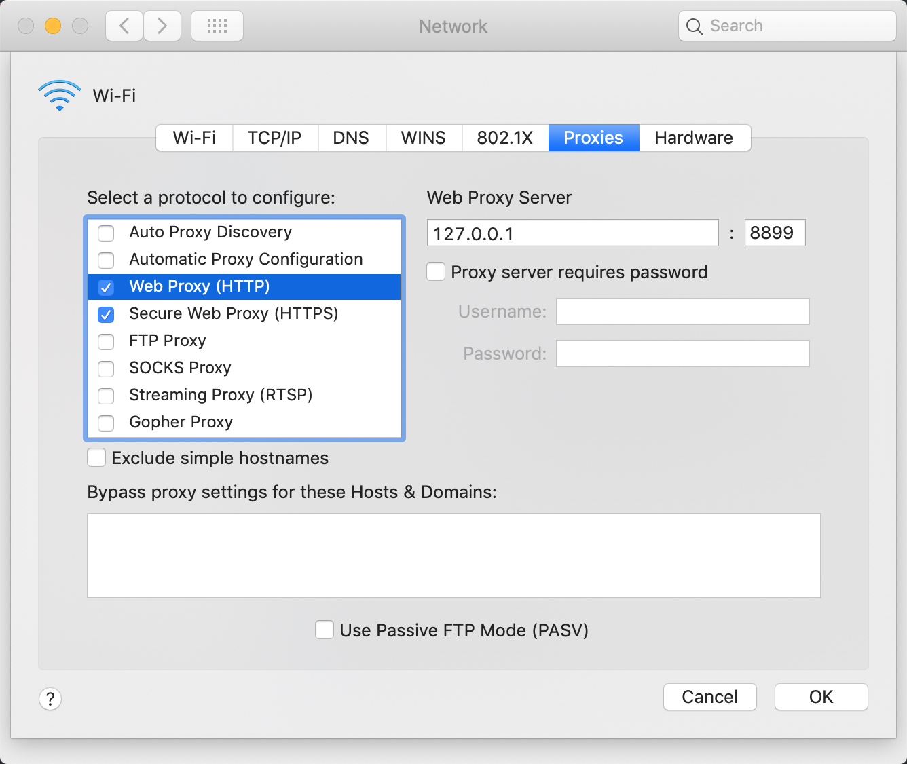
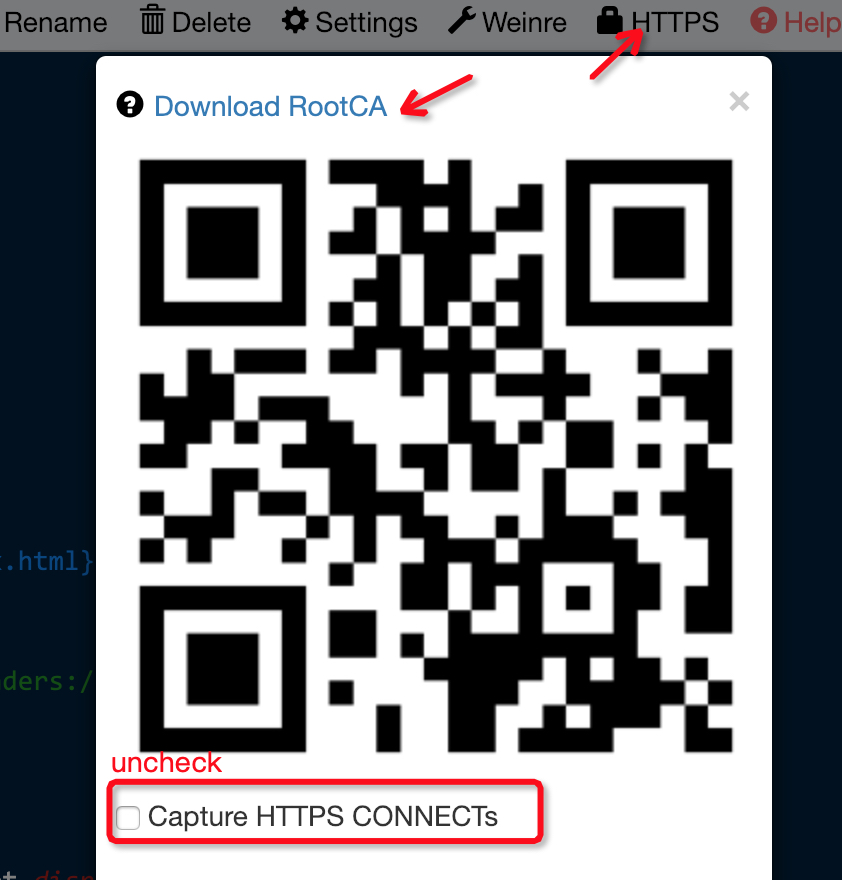
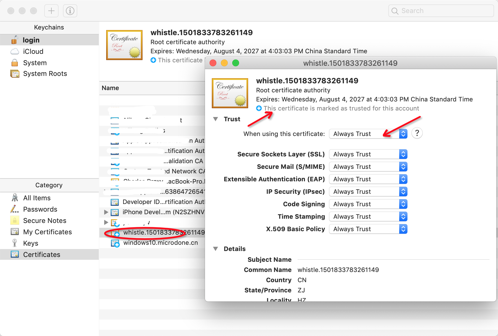

# 安装

## 安装Node

## 安装whistle

## 设置代理

### 设置移动端代理

移动端需要在设置中配置当前Wi-Fi的代理，以 iOS 为例：

<div></div>

Android同理，通过Wi-Fi来设置代理。

### 设置系统代理

1. Mac: System Preferences > Network > Advanced > Proxies

  <div></div>

2. Windows: [windows 7 系统如何设置代理服务器](https://jingyan.baidu.com/article/0aa22375866c8988cc0d648c.html)

3. Linux: Settings > Network > VPN > Network Proxy > Manual
  
  <div>
    
    
  </div>

### 设置浏览器代理

1. Chrome: 推荐使用[SwitchyOmega](https://chrome.google.com/webstore/detail/padekgcemlokbadohgkifijomclgjgif)

  <div></div>

2. Safari: 可以通过设置系统代理的方式来使用代理

3. Firefox: 地址栏输入访问 `about:preferences`，搜索`Network Proxy`，选择 `手动代理配置(Manual proxy configuration)`，输入代理服务器地址、端口，保存

  <div>
    
    
  </div>

## 安装根证书

移动端需要在设置代理并关闭HTTPS拦截后，通过访问 `http://rootca.pro/` 在浏览器打开并安装。PC端可直接通过`HTTPS`菜单下的下载入口来下载安装证书。

<div></div>

_安装证书后，可重新勾选 `Capture HTTPS CONNECTs`_

### iOS

iOS 10.3 之后需要手动信任自定义根证书，设置路径：Settings > General > About > Certificate Trust Testings

[详细请可以参考这篇文章](http://www.neglectedpotential.com/2017/04/trusting-custom-root-certificates-on-ios-10-3/)

<div></div>

### Android

* 部分浏览器不会自动识别 ca 证书，可以通过 Android Chrome 来完成安装

* android 6.0 之后的一些app在成功安装证书后仍然无法对https连接进行手抓包，有可能是该app没有添加信任用户自定义证书的权限。请确认该app是否有如下配置：

  ```xml
  <base-config cleartextTrafficPermitted="true">
   <trust-anchors>
       <certificates src="system" />
       <certificates src="user" />
   </trust-anchors>
  </base-config>
  ```

  这主要是因为android 6.0之后的版本默认配置发生了变化，更多请看[Android开发文档](https://developer.android.com/training/articles/security-config#base-config)。

### Windows

证书安装过程中，要确保证书存储到受信任的根证书颁发机构下。

更多请参考：[Installing a root certificate on Windows](https://msdn.microsoft.com/zh-cn/library/cc750534.aspx)

<div></div>

### Mac

Mac 安装证书后，需要手动信任证书：

<div></div>

### Linux

Chrome(Chromium)：[参照这个教程](http://www.richud.com/wiki/Ubuntu_chrome_browser_import_self_signed_certificate)

1. 地址栏输入chrome://settings/
2. Show advanced Settings > Manage certificates > Authorities > Import
3. 选择证书后确认，重启浏览器
4. done

<div></div>

### 可能遇到的问题

按下面步骤安装证书后，如果还出现安全提醒，这个主要原因是之前你访问过该页面，导致长连接已建立，可以等段时间再访问、或重新打开浏览器，或重启下whistle: `w2 restart`

## 更新whistle
