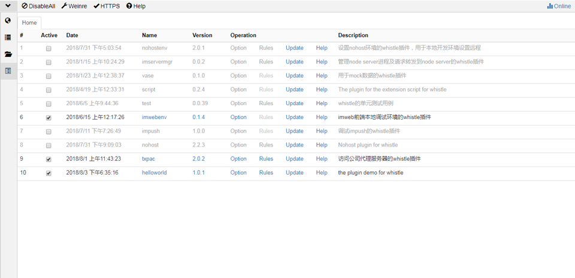
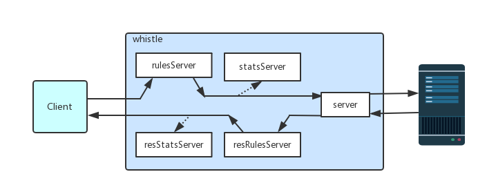
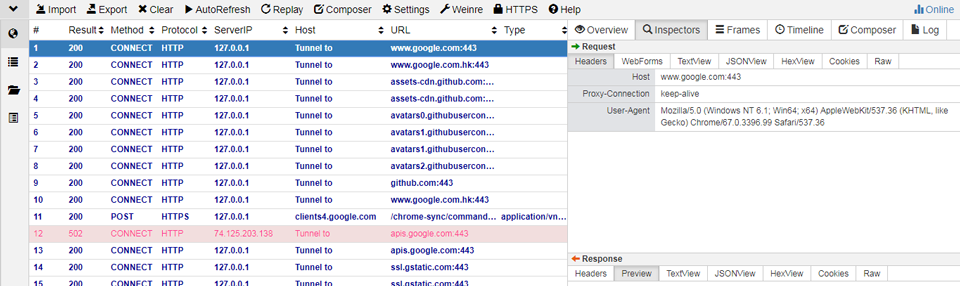
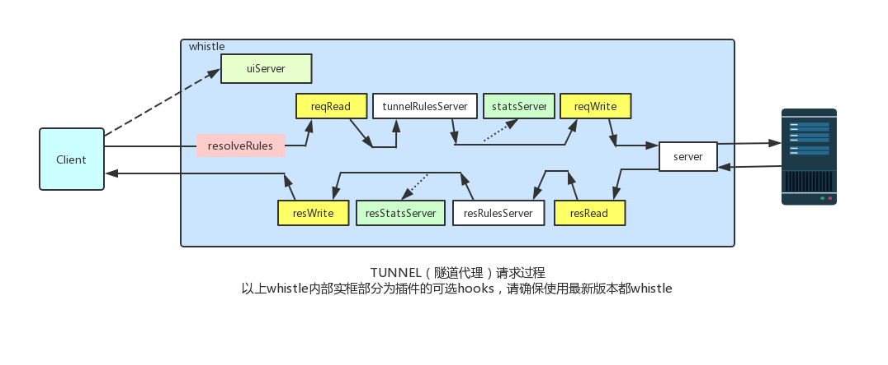
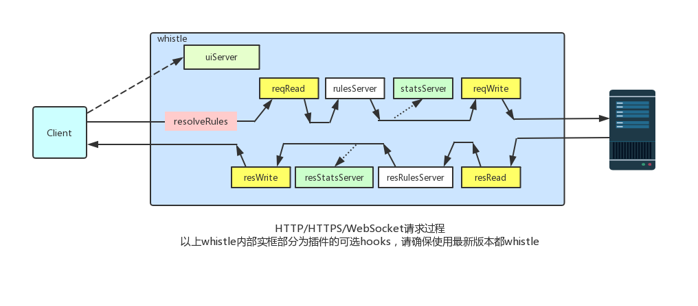

# 插件开发
为了满足一些特定业务场景的需要，whistle提供了插件扩展能力，通过插件可以新增whistle的协议实现更复杂的操作、也可以用来存储或监控指定请求、集成业务本地开发调试环境等等，基本上可以做任何你想做的事情，且开发、发布及安装whistle插件也都很简单。

先了解下如何安装使用插件：

#### 安装插件
whistle的插件就是一个Node模块，名字必须为 `whistle.your-plugin-name` 或 `@org/whistle.your-plugin-name`，其中 `your-plugin-name` 为插件名称，只能包含 `小写字母(a-z)`、`数字(0-9)`、`_`、`-` 四种字符，安装插件直接全局npm安装即可：

```
npm i -g whistle.your-plugin-name
# 或
npm i -g @org/whistle.your-plugin-name
```
> Mac或Linux安装时如果报权限错误，则需要加上sudo，如：sudo npm i -g whistle.your-plugin-name
> 国内可以用[cnpm](https://github.com/cnpm/cnpm)或公司内部自己的镜像安装

全局安装后，可以在whistle的界面上看到所有已安装的插件列表(whistle定时搜索npm的全局目录，并自动加载或卸载插件，无需重启whistle)。

> 要更新插件的时候，重新安装即可

安装成功后可以在whistle的插件列表看到新安装的插件：


#### 使用插件
插件安装后，whistle会新增两个协议，分别为 `whistle.your-plugin-name` 和 `your-pluign-name`，用户通过配置：
```
pattern whistle.your-plugin-name://xxx
# 或
pattern your-plugin-name://xxx
```
匹配到上述规则的请求会自动请求插件相应的server，上述两种配置有些差异，后面再详细说下，下面我们先了解下插件基本原理，并快速开发一个whistle插件的项目。

# 实现原理
whistle的插件是一个独立运行的进程，这样是为了确保插件不会影响到whistle主进程的稳定性，并通过暴露一些http server的方式实现与whistle的交互，whistle会在特定阶段请求特定的server，具体看下面的原理图：



> 图一：表示http(s)、WebSocket请求涉及到的插件内置server




> 图二：表示tunnel请求涉及到的插件内置server，tunnel请求如上图指没有开启https捕获，或代理到whistle的Socket请求

从上面几个图可以知，whistle插件会设计以下7种server：

1. statsServer：统计请求信息的服务
2. resStatsServer：统计响应信息的服务
3. rulesServer：设置请求规则的服务(支持http/https/websocket请求)
4. resRulesServer：设置响应规则的服务(支持http/https/websocket请求)
5. tunnelRulesServer：设置tunnel请求规则的服务
6. server：whistle会把指定请求转发到该server
7. uiServer: whistle插件的界面，可以通过特定的url访问

插件就是通过上述中的0-N个server实现相应的功能，并通过配置规则将请求转发到插件的各个server：
```
pattern whistle.your-plugin-name://xxx
# 或
pattern your-plugin-name://xxx
```
只要匹配pattern的请求才会转到插件的各个server，上述两种配置的区别是：

1. `pattern whistle.your-plugin-name://xxx`：请求默认不会走到插件里面的 `server` 服务

  > 可以通过在`rulesServer`里面重新设置 `pattern your-plugin-name://xxx` 把请求转发到 `server` 里面
2. `pattern your-plugin-name://xxx`：默认会经历所有server

除了用户手动配置，插件也可以自动规则，只需在插件模块的根目录新建一个  `rules.txt` 文件，里面可以设置所有whistle规则，包括当前插件的添加的新协议，这个文件的规则是公共的，相当于在：
```
# rules.txt
www.test.com/cgi-bin whistle.your-plugin-name://xxx
```
上述配置表示所有 `www.test.com/cgi-bin` 路径下的请求都会转到插件来。

除了 `rules.txt` 外，根目录还可以建插件私有规则：

1. `_rules.txt`：whistle规则，相当于 `rulesServer` 返回的规则
2. `_values.txt`：json对象，相当于 `rulesServer` 返回的Values

为了方便各个server直接的通讯及初始化插件配置，可以在插件根目录创建一个 `initial.js` 的文件，插件首先加载该文件，另外还可以通过插件直接获取抓包数据等，具体插件API及如何开发插件参见：[插件开发Demo](https://github.com/whistle-plugins)

#### 调试插件
1. 开启whistle的调试模式：
    ```
    w2 stop
    w2 run
    ```
    > 这样可以在控制台看到插件console输出的日志及错误
2. 修改插件代码后，需要触发插件项目的 `package.json` 修改才会重新加载该插件，比如添加或删除一个空格。
3. 完整API先看下源码：
  - [req.originalReq & req.originalRes](https://github.com/avwo/whistle/blob/master/lib/plugins/load-plugin.js#L46)
  - [getReqSessions & getSession & getFrames](https://github.com/avwo/whistle/blob/master/lib/plugins/load-plugin.js#L258)
  - [getReqSessions & unsafe_getSession & unsafe_getFrames](https://github.com/avwo/whistle/blob/master/lib/plugins/load-plugin.js#L269)


更多例子参考：

1. [https://github.com/whistle-plugins/whistle.script](https://github.com/whistle-plugins/whistle.script)
2. [https://github.com/whistle-plugins](https://github.com/whistle-plugins)
