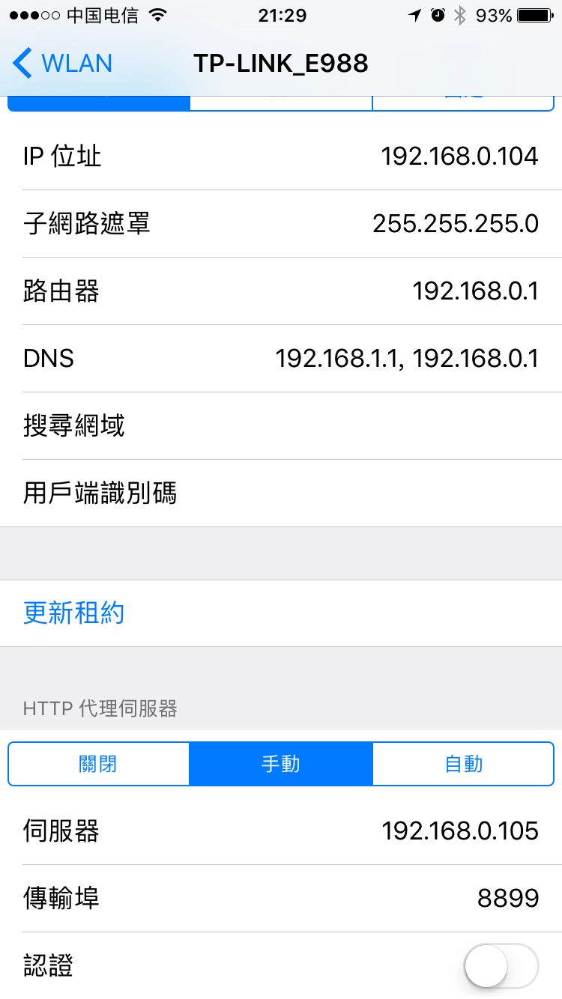

# 快速上手
> 如未安装 Whistle，请先参考 README 安装：https://github.com/avwo/whistle#readme

安装成功后，打开 Whistle 管理界面 http://local.whistlejs.com ：

## 界面操作


**切到  Rules 并点击 `Create` 新建一个 测试环境 接下来看下如何通过设置规则操作请求。**
## 设置 Hosts
1. 普通的 Hosts 配置：
    ``` txt
    test1.wproxy.org 127.0.0.1
    test2.wproxy.org 127.0.0.1

    # 或

    127.0.0.1 test1.wproxy.org test2.wproxy.org
    ```
2. 也支持带端口，匹配路径、协议、正则、通配符等：
    ``` txt
    test1.wproxy.org/path/to 127.0.0.1:6001
    https://test2.wproxy.org/path1/to1 127.0.0.1:6001
    # 根据请求参数设置 host
    /google/ 127.0.0.1:6001

    # 或

    127.0.0.1:6001 test1.wproxy.org/path/to https://test2.wproxy.org/path1/to1 /google/
    ```
3. 支持 cname：
    ``` txt
    test1.wproxy.org/path/to host://www.qq.com:8080
    ```
4. 支持通过请求参数设置 Hosts：
    ``` txt
    /host=([\w.:-]+)/ host://$1
    ```
    

    

    

## 修改请求 Cookie
``` txt
www.qq.com reqCookies://custom_key1=123&custom_key2=789
```


## 请求替换
1. 替换本地内容
    ``` txt
    test.wproxy.org/test file:///Users/xx/statics
    ```
    > `test.wproxy.org/test` 及其子路径 `test.wproxy.org/test/path/to` 请求 会尝试读取本地文件 `/Users/xx/statics/path/to`
2. 替换其它请求
    ``` txt
    test.wproxy.org/test https://ke.qq.com
    ```
    > `test.wproxy.org/test` 及其子路径 `test.wproxy.org/test/xxx` 请求会用 ` https://ke.qq.com/xxx` 响应头和内容替换

    

    


## 查看 JS 报错及页面 `console.log`
``` txt
ke.qq.com log://
```


## 修改响应状态码
``` txt
# 模拟响应 500（请求不会到后台服务）
test3.wproxy.org/path/to statusCode://500

# 修改响应状态码（请求会到后台服务）
test4.wproxy.org/path/to replaceStatus://400

# 302 重定向
test5.wproxy.org/path redirect://https://ke.qq.com/

# 301 重定向
test6.wproxy.org/path redirect://https://ke.qq.com/ replaceStatus://301
```


### 手机设置代理

<div style="display:-webkit-box;display:flex;">
  <div style="display:inline-block;width:40%;margin-left:5%;">
    
    <br>
    <p style="text-align:center">iOS</p>
  </div>
  <div style="display:inline-block;width:40%;margin-left:5%;">
    
    <br>
    <p style="text-align:center">Android</p>
  </div>
</div>


更多功能请参考：[协议列表](rules/index.html)
