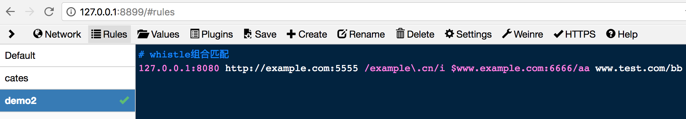

# host
> whistle的host转发功能，在保留传统hosts语法规则的同时，提供了更加灵活强大的匹配方式来满足不同场景的开发、调试需要。

### 保留传统的hosts语法规则

如果你习惯了通过修改操作系统hosts文件 (windows下为`C:Windows\System32\drivers\etc\hosts`，mac下为`/etc/hosts`) 的方式来修改域名解析，那么使用whistle时也可以采用同样的方法，并且不再需要使用管理员身份进行操作，切换起来也更加简洁。


> **操作指引：**[启动whistle并设置好代理](../install.html)后，在浏览器中打开whistle页面，在Rules中添加一个新的配置项并勾选启用，在对应的配置编辑器中输入host规则即可。如图，访问`www.example.com`域名即会转发到本地80(或https：443)端口。

----

### 灵活强大的whistle匹配方式



除了保留hosts文件单一的语法规则来支持域名匹配外，whistle还提供给开发者更加灵活强大的端口映射(即支持ip带端口)、CNAME、路径匹配、精确匹配、正则表达式、组合等host匹配方式。语法规则的一般描述如下：

```
host pattern1 pattern2 patternN
```

> host为计划转发到`ip:port`，pattern1-N为匹配请求url的表达式。当pattern只有一个时，host和pattern的顺序往往可以互换，具体可参考[匹配方式](../pattern.html)。

### 例子

- **端口映射**

  ```
  127.0.0.1:8080 www.example.com
  # 位置可以调换，等价于： 
  # www.example.com  127.0.0.1:8080
  ```

  > 对于本地开发调试，往往无法只在80端口提供Web服务。如果使用传统的hosts文件方式，我们只能通过`www.example.com:8080`访问到本地的8080端口，使用whistle提供的端口映射功能即可很好解决这一问题。

- **CNAME**

  ```
   host://www.qq.com www.example.com 
   # 位置可以调换，等价于： 
   # www.example.com  host://www.qq.com
  ```

  > 通过关键字`host`可以实现类似DNS的cname别名的功能，即通过域名`www.example.com`访问时，先访问的地址是通过解析域名`www.qq.com`得到的，与请求转发 `www.example.com www.qq.com` 不同，上面的配置不会后台收到的还是 `www.example.com` 的请求，而请求转发收到的是转发后url的请求。

- **路径匹配**

  ```
  127.0.0.1:8080 example.com/test 
  # 位置可以调换，等价于： 
  # example.com/test 127.0.0.1:8080
  ```

  > 通过配置上述规则，可将`example.com/test`路径下的请求转发到本地的8080端口，比如请求`example.com/test/a.html`、`example.com/test?a=1`，但对于请求`example.com/testa`则不会进行转发处理。注意，使用传统的hosts语法，是将该域名下的所有请求都进行host替换处理。

- **精确匹配**

  ```
  127.0.0.1:8080 $example.com/test 
  # 位置可以调换，等价于： 
  # $example.com/test 127.0.0.1:8080
  ```

  > 通过关键字`$`，只有请求`example.com/test`会转发到本地的8080端口，对于域名example.com外的其他请求都不会进行转发处理。

- **正则表达式**

  ```
  127.0.0.1:8080 /example\.com/i 
  # 位置可以调换，等价于： 
  # /example\.com/i  127.0.0.1:8080
  ```

  > 通过配置上述规则，符合正则表达式`/example\.com/i`的请求，将转发到本地的8080端口进行处理，如请求`example.com/index.html`、`www.example.com/index.html`都将进行转发处理。

- **通配符匹配**

  ```
  127.0.0.1:8080 */cgi-bin/test
  # 位置可以调换，等价于： 
  # */cgi-bin/test  127.0.0.1:8080
  ```

  > 通过配置上述规则，符合正则表达式`xx.xx.xx/cgi-bin/test`的请求，将转发到本地的8080端口进行处理，如请求`example.com/cgi-bin/test/index.html`、`www.example.com/cgi-bin/test`都将进行转发处理。

- **组合匹配**

  ```
  127.0.0.1:8080 http://example.com:5555 /example\.cn/i $www.example.com:6666/aa www.test.com/bb
  ```

  > 通过配置上述规则，域名`example.com:5555`下的所有http请求、请求中含有`example.cn`的所有请求、请求`www.example.com:6666/aa`、路径`www.test.com/bb`下的所有请求，都会转发到本地的8080端口。

#### 过滤规则
需要确保whistle是最新版本：[更新whistle](../update.html)

如果要过滤指定请求或指定协议的规则匹配，可以用如下协议：

1. [ignore](./ignore.html)：忽略指定规则
2. [filter](./filter.html)：过滤指定pattern，支持根据请求方法、请求头、请求客户端IP过滤

例子：

```
# 下面表示匹配pattern的同时不能为post请求且请求头里面的cookie字段必须包含test(忽略大小写)、url里面必须包含 cgi-bin 的请求
# 即：过滤掉匹配filter里面的请求
pattern operator1 operator2 excludeFilter://m:post includeFilter://h:cookie=test includeFilter:///cgi-bin/i

# 下面表示匹配pattern1、pattern2的请求方法为post、或请求头里面的cookie字段不能包含类似 `uin=123123` 且url里面必须包含 cgi-bin 的请求
operator pattern1 pattern2 includeFilter://m:post excludeFilter://h:cookie=/uin=o\d+/i excludeFilter:///cgi-bin/i

# 下面表示匹配pattern的请求忽略除了host以外的所有规则
pattern ignore://*|!host

# 下面表示匹配pattern的请求忽略file和host协议的规则
pattern ignore://file|host
```
