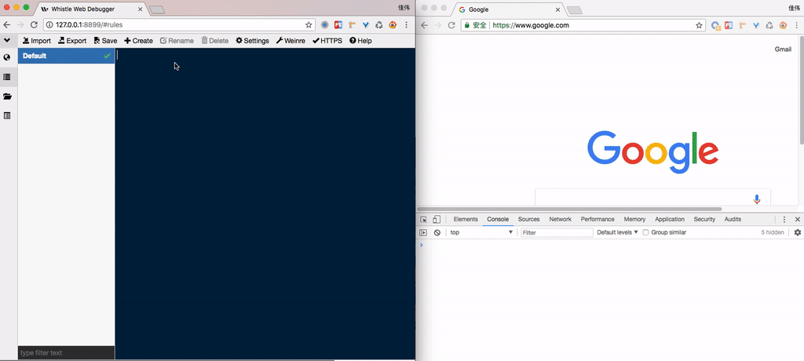

# log

> whistle 的 log 规则主要用于调试远程页面特别是移动端页面，可以通过此规则把远程页面 `console` 打印的信息展示出来。

通过自动监控 html 页面或 js 文件出现的错误及 `console.xxx` 打印出来的信息，会自动在 whistle 界面的 log 模块显示这些错误及信息日志。

## 快速上手

假如正在开发用于移动端的 `www.qq.com` 页面，作为开发者的我们会格外关心页面的错误和 `console` 打印的信息，通过如下设置如下规则，并设置手机代理将手机的请求转发至 whistle，则可以在 PC 上看到这些内容:

```
www.qq.com log://
```



## 进阶使用

### 不同页面 log 切换

为了方便同时调试不同的网页，whistle 从 **1.9.12** 版本开始支持不同页面的 log 信息切换，假如我们同时在调试 `news.qq.com` 和 `ke.qq.com` 两个页面，那么通过设置如下规则可以在 `All Logs` 选项卡中切换查看不同页面的 log:

```
ke.qq.com log://ke
news.qq.com log://news
```


### 嵌入自定义脚本

通过 log 规则还可以嵌入自定义的脚本调试页面，并且脚本中的 console 信息也会显示在 whistle 界面的 log 模块中，具体的配置方式如下：

	pattern log://filepath

`filepath` 为 [Values](http://local.whistlejs.com/#values) 里面的 {key} 或者本地文件的 js 脚本(如：`e:\test\xxx`、`e:/test/xxx`、`/User/username/test/xxx `等)，pattern参见[匹配模式](../pattern.html)，更多模式请参考[配置方式](../mode.html)。

例子：

	www.ifeng.com log://{test.js}

[Values](http://local.whistlejs.com/#values) 里面的`test.js`分组内容：

	console.log(1, 2, 3, {abc: 123});

> 注意：如果仅是为了向页面嵌入 js 脚本，更推荐使用 [resPrepend](http://wproxy.org/whistle/rules/reqPrepend.html) 向页面头部追加内容或者 [resAppend](http://wproxy.org/whistle/rules/resAppend.html) 向页面尾部追加内容。

#### 过滤规则
需要确保whistle是最新版本：[更新whistle](../update.html)

如果要过滤指定请求或指定协议的规则匹配，可以用如下协议：

1. [ignore](./ignore.html)：忽略指定规则
2. [filter](./filter.html)：过滤指定pattern，支持根据请求方法、请求头、请求客户端IP过滤

例子：

```
# 下面表示匹配pattern的同时不能为post请求且请求头里面的cookie字段必须包含test(忽略大小写)、url里面必须包含 cgi-bin 的请求
# 即：过滤掉匹配filter里面的请求
pattern operator1 operator2 excludeFilter://m:post includeFilter://h:cookie=test includeFilter:///cgi-bin/i

# 下面表示匹配pattern1、pattern2的请求方法为post、或请求头里面的cookie字段不能包含类似 `uin=123123` 且url里面必须包含 cgi-bin 的请求
operator pattern1 pattern2 includeFilter://m:post excludeFilter://h:cookie=/uin=o\d+/i excludeFilter:///cgi-bin/i

# 下面表示匹配pattern的请求忽略除了host以外的所有规则
pattern ignore://*|!host

# 下面表示匹配pattern的请求忽略file和host协议的规则
pattern ignore://file|host
```
