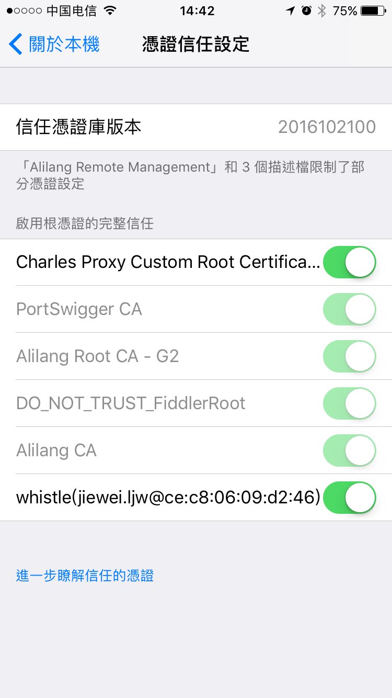

# Https

下载根证书，开启捕获HTTPS请求：


## 安装根证书
> 证书按下面步骤安装后，如果还出现安全提醒，这个主要原因是之前你访问过该页面，导致长连接已建立，可以等段时间再访问、或重新打开浏览器，或重启下whistle： `w2 restart`

如上图下载完根证书后点击rootCA.crt文件，弹出根证书安装对话框。

1. Windows:

  [Installing a root certificate on Windows](https://msdn.microsoft.com/zh-cn/library/cc750534.aspx)

  

  下载证书后，双击证书，根据指引安装证书。证书安装过程，要确保证书存储到`受信任的根证书颁发机构`下。
  
2. Mac: [Mac根证书怎么安装](http://zhidao.baidu.com/link?url=bQ8ZnDTxUIlqruQ56NYjBmwztWPlZtv9AIRazkoKeMsdpAq7mcwXOHQduRwmHV1M2hf143vqBxHzKb1tg0L03DJoj6XS109P8zBNF1E9uU_)

  Mac 安装证书后，需要手动信任证书，步骤如下：

 

  打开证书管理界面，找到带有 `whistle` 的字样的证书，如果有多个又不确定最新安装的是哪个，可以全部删除后重新安装

  

  双击证书后，点击 `Trust` 左边展开选项，红色部分选择 `Always Trust` （总是信任），点击左上角关闭当前界面会要求输入密码；输入密码后可
  以看到证书上面红色的图标 `x` 不见了，到这一步说明完成证书安装。

  
  
3. Linux:

  Linux 安装较为复杂，根据发行版本的不同，安装位置可能略有变化，以下是一些常用发行版的安装方法：
  
  - ArchLinux: 将下载的 rootCA.crt 复制到 `/etc/ca-certificates/trust-source/anchors/` 然后执行 `trust extract-compat`
  - Fedora: 将下载的 rootCA.crt 复制到 `/etc/pki/ca-trust/source/anchors` 然后执行 `trust extract-compat`
  - Ubuntu/Debian: 将下载的 rootCA.crt 复制到 `/usr/share/ca-certificates/` 然后执行 `echo "rootCA.crt" >> /etc/ca-certificates.conf && update-ca-certificates`
  
  如果成功安装，命令 `trust list | grep -i whistle` 输出不为空。

5. Firefox:

  菜单 > 首选项 > 高级 > 证书 > 证书机构 > 导入 -> 选中所有checkbox -> 确定
  
  
4. Linux Chrome(Chromium):
  * 地址栏输入`chrome://settings/`
  * Show advanced Settings > Manage certificates > Authorities > Import
  * 选择证书后确认，重启浏览器
  * done
  > 详细内容参照这个[教程](http://www.richud.com/wiki/Ubuntu_chrome_browser_import_self_signed_certificate)
5. 手机

  **iOS**
  * 手机设置代理后，Safari 地址栏输入 `rootca.pro`，按提示安装证书（或者通过 `whistle` 控制台的二维码扫码安装，iOS安装根证书需要到连接远程服务器进行验证，需要暂时把**Https拦截功能关掉**）
  * iOS 10.3 之后需要手动信任自定义根证书，设置路径：`Settings > General > About > Certificate Trust Testings`

  [具体可以看这里](http://www.neglectedpotential.com/2017/04/trusting-custom-root-certificates-on-ios-10-3/)

  

  **Android**
  * `whistle` 控制台二维码扫码安装，或者浏览器地址栏 `rootca.pro` 按提示安装
  * 部分浏览器不会自动识别 ca 证书，可以通过 Android Chrome 来完成安装
  * android 6.0 之后的一些app在成功安装证书后仍然无法对https连接进行手抓包，有可能是该app没有添加信任用户自定义证书的权限。请确认该app是否有如下配置：
    ```
    <base-config cleartextTrafficPermitted="true">
        <trust-anchors>
            <certificates src="system" />
            <certificates src="user" />
        </trust-anchors>
    </base-config>
    ```
    这主要是因为android 6.0之后的版本默认配置发生了变化，[更多请看Android开发文档](https://developer.android.com/training/articles/security-config#base-config)。

## 开启拦截HTTPS

图中的打开的对话框有个checkbox：

1.`Capture HTTPS CONNECTs`：开启Https拦截功能，只有勾上这个checkbox及装好根证书，whistle才能看到HTTPS、Websocket的请求
2. 也可以通过配置来开启对部分请求的Https拦截功能
  ```plain
  www.test.com enable://intercept
  /alibaba-inc/ enable://intercept
  ```
  > 也可以用过 enable://capture
3. 如果想过滤部分请求不启用Https拦截功能
  ```plain
  # 指定域名
  www.baidu.com  disable://intercept

  # 通过正则
  /baidu/ disable://intercept

  # 不支持通过路径的方式设置
  ```

  ### 自定义请求证书或根证书
  whistle会自动生成根证书，并根据根证书对每个请求动态生成https证书，如果需要用自定义的证书，甚至根证书，可以有两种方式(只支持 `.crt` 格式的证书)：

  1. 把普通证书对 (如：`test.crt` 和 `test.key`、`test2.crt` 和 `test2.key` 等等) 或根证书 (名字必须为 `root.crt` 和 `root.key`)，放在系统的某个目录，如 `/data/ssl`，并在启动时添加启动参数 `w2 start -z /data/ssl` ，whistle会自动加里面的证书
  2. (v1.14.8及以上版本支持) 把上述证书或根证书放在固定目录 `~/.WhistleAppData/custom_certs/`里面，whistle会自动加里面的证书
    > 优先级 `-z dir` > `~/.WhistleAppData/` > 内置证书
