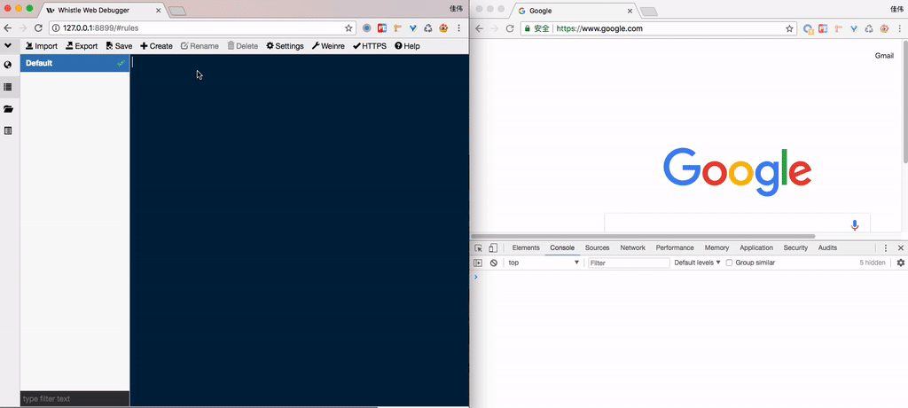

# Log

> 主要用于调试远程页面特别是移动端页面，可以通过此功能把远程页面 `console` 打印的信息展示出来，使用方法参见 [log](../rules/log.html)。

其中：

1. `Console` 显示页面抛出的异常或通过 `console` 打印的信息
2. `Server` 显示 whistle 内部发生的异常信息
3. `All Logs` 用于切换不同页面的 log 显示，这个功能详见 [log 高级使用](../rules/log.html)